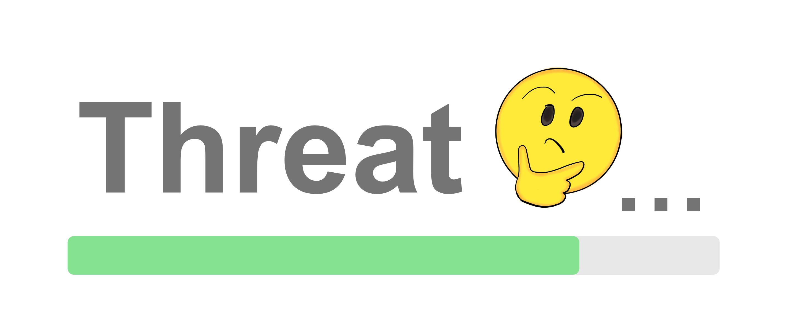
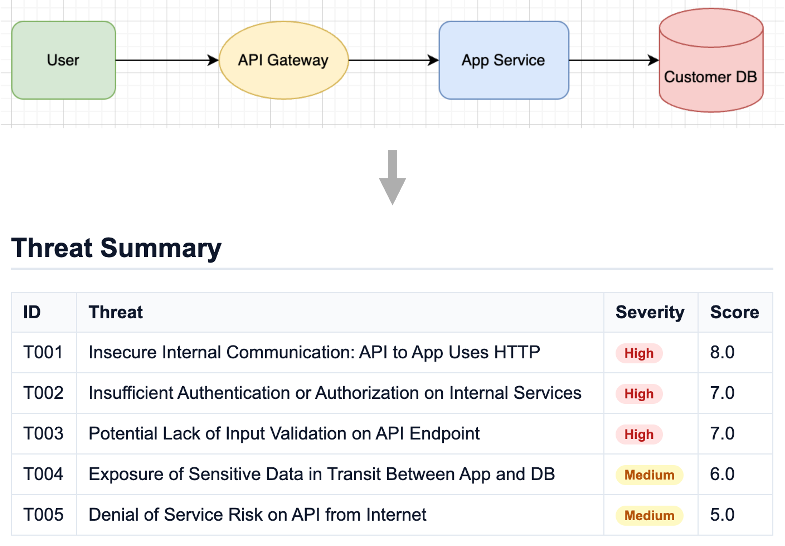
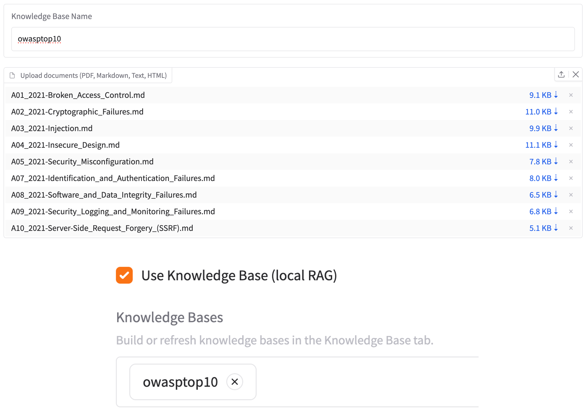
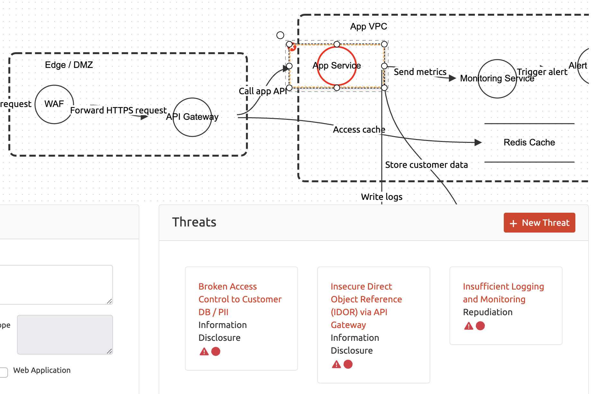

# Threat Thinker
アーキテクチャ図とビジネスコンテキストを、実用的な脅威へ変換する AI ベースの脅威モデリングツールです。

[English](./README.md) | **日本語**

**公開デモ**: [https://threat-thinker.melonattacker.com](https://threat-thinker.melonattacker.com/)

> [!IMPORTANT]
> これは公開デモ環境です。機密性の高いアーキテクチャ図や社外秘情報はアップロードしないでください。
> 機密データを扱う場合は、ローカルの CLI または Web UI を利用してください。

> [!IMPORTANT]
> AI は誤ることがあります。Threat Thinker の出力をそのまま信頼せず、利用前に必ずレビューして妥当性を確認してください。




## Threat Thinker とは？
Threat Thinker は、システム記述・アーキテクチャ図・ビジネスコンテキストから脅威モデルを自動生成するオープンソースツールです。図がない場合は自然言語のシステム説明を入力し、DFD やアーキテクチャ図がある場合はそれを読み込み、さらに Business Context を追加してスコープや前提を補足できます。必要に応じて RAG を使い、社内基準や標準文書などの参照情報も脅威推論に取り込めます。

主な特徴:
- **Description-to-DFD**: 図がない場合でも、自然言語のシステム説明から中間表現の Graph IR DFD を生成します。
- **幅広い図形式に対応**: Mermaid、draw.io、Threat Dragon JSON、ネイティブ Graph IR JSON、画像を入力できます。
- **Business Context**: PDF、Markdown、テキストからスコープ、関係者、資産、前提、制約を脅威分析へ反映します。
- **属性推論**: LLM を使ってコンポーネント、データフロー、トラストバウンダリの属性を補完します。
- **RAG 強化**: ローカル文書や KB から取得した断片を使って脅威推論を補強します（例: OWASP、MITRE、社内ガイド）。
- **Threat Dragon 連携**: Threat Dragon の図を読み込み、検出結果を Threat Dragon 形式で書き戻せます。
- **レポート出力**: Markdown、JSON、HTML を出力し、レビューや自動処理に利用できます。

## 主な機能
### 図から脅威を推論
- 図がない場合は `--description` を指定し、CLI では `--diagram` や形式別フラグ、Web UI ではアップロードで図を入力できます。
- Mermaid、draw.io、Threat Dragon JSON、ネイティブ Graph IR JSON、画像ベースの図に対応します。
- 決定的なパースと LLM 推論を組み合わせ、欠けているラベル、トラストバウンダリ、プロトコルを補います。
- 優先度付きの脅威を、簡潔な根拠と OWASP ASVS/CWE 参照付きで出力します。

<p align="center">
    
    <br>
    <em>図を入力すると、優先度付きの脅威を自動生成</em>
</p>

### Business Context を第一級の入力として扱う
- 図がない場合は `--description` にシステム説明を渡し、DFD を生成できます。
- DFD やアーキテクチャ図に表れない情報は `--context` で補います。
- スコープ、関係者、重要資産、業務フロー、規制上の前提、可用性要件、監査要件などを追加できます。
- Threat Thinker は PDF、Markdown、テキストから抽出した全文を脅威プロンプトへ注入します。
- より大きな KB から関連文書も引きたい場合は、Business Context と RAG を併用できます。

### ローカル RAG で精度を高める
- PDF、Markdown、HTML からオンディスクのナレッジベースを `threat-thinker kb build` で `~/.threat-thinker/kb/<name>` に構築できます。
- CLI では `--rag`、Web UI では “Use Knowledge Base” トグルで、セキュリティガイドラインや社内基準から関連チャンクを取得できます。
- 取得処理はローカルで完結し、最終的なプロンプトだけが選択した LLM プロバイダに送られます。
- 実行ごとに top-k や KB を切り替え、深さ・速度・関連性のバランスを調整できます。

<p align="center">
    
    <br>
    <em>ローカルナレッジベースを構築し、脅威推論を強化</em>
</p>

### Threat Dragon の往復対応
- [Threat Dragon](https://owasp.org/www-project-threat-dragon/) v2 JSON を `--threat-dragon` で読み込み、レイアウトやセルのメタデータを保持します。
- 検出した脅威を埋め込んだ Threat Dragon 互換 JSON を、座標を再生成せずに出力できます。
- 出力 JSON を Threat Dragon で再度開き、追加された所見を含む図をレビュー・調整できます。
- Markdown、JSON、HTML レポートも同時に出力でき、より広い共有用途に使えます。

<p align="center">
    
    <br>
    <em>Threat Dragon 図を読み込み、脅威結果を埋め込んで再出力</em>
</p>

## はじめに
### API キーの設定
Threat Thinker は、画像からの図抽出、アーキテクチャ図からのコンポーネント・データフロー・トラストバウンダリ抽出、脅威推論に LLM を利用します。OpenAI、Anthropic Claude、AWS Bedrock（Claude v3+）、ローカル Ollama（テキストのみ）をサポートします。

利用前に、少なくとも次のいずれかの環境変数を設定してください。

```bash
# OpenAI API の場合（例: gpt-4.1）
export OPENAI_API_KEY=...

# Claude API の場合（例: claude-sonnet-4-5）
export ANTHROPIC_API_KEY=...

# Bedrock API の場合（例: anthropic.claude-sonnet-4-5-20250929-v1:0）
# 方法 1: AWS Profile を使う（推奨）
aws configure --profile my-profile
# その後、コマンドで --aws-profile my-profile を指定

# 方法 2: 環境変数を使う
export AWS_ACCESS_KEY_ID=...
export AWS_SECRET_ACCESS_KEY=...
export AWS_SESSION_TOKEN=...
```

### ローカル Ollama（API キー不要）
- Ollama をローカルで起動し（既定ホストは `http://localhost:11434`）、モデルを取得します（例: `ollama pull llama3.1`）。
- Mermaid、Draw.io、Threat Dragon 入力に対して `--llm-api ollama --llm-model <model> [--ollama-host http://localhost:11434]` で実行できます。
- 画像からの抽出は Ollama バックエンドでは非対応のため、テキストベースの図入力を使ってください。

### インストール

次のいずれかの方法でインストールできます。

#### [pipx](https://pipx.pypa.io/) を使う
```bash
pipx install threat-thinker
```

#### [uv](https://docs.astral.sh/uv/) を使う
```bash
uv tool install threat-thinker
```

#### pip を使う
```bash
pip install threat-thinker

# または GitHub Release の wheel からインストール
pip install https://github.com/melonattacker/threat-thinker/releases/download/v0.7.0/threat_thinker-0.7.0-py3-none-any.whl

# または main ブランチの最新をインストール
pip install git+https://github.com/melonattacker/threat-thinker.git
```

> **注意**: `externally-managed-environment` エラーが出る場合は、
> `pipx` または `uv` を使うか、先に仮想環境を作成してください。

#### 開発用セットアップ
```bash
git clone https://github.com/melonattacker/threat-thinker.git
cd threat-thinker
uv sync --extra dev --frozen

# uv が使えない場合の代替
python3 -m venv .venv
source .venv/bin/activate
pip install -e .[dev]
```

#### インストール確認
```bash
threat-thinker version
threat-thinker -v
threat-thinker --help
```

### CLI の使い方
CLI モードのコマンド例です。

```bash
# Think: システム説明から DFD を生成し、脅威を分析
threat-thinker think \
    --description "Customers use a web app to manage orders. The app stores customer PII in Postgres and sends email through a third-party provider." \
    --topn 5 \
    --llm-api openai \
    --llm-model gpt-4.1 \
    --out-dir reports/

# Think: 図を解析
threat-thinker think \
    --diagram examples/diagrams/web/system.mmd \
    --context examples/diagrams/web/business-context.md \
    --infer-hints \
    --topn 5 \
    --llm-api openai \
    --llm-model gpt-4.1 \
    --out-dir reports/

# Diff: 2 つの脅威レポートを比較し、変更点を解析
threat-thinker diff \
    --after reports/new-report.json \
    --before reports/old-report.json \
    --llm-api openai \
    --llm-model gpt-4.1 \
    --out-dir reports/ \
    --lang en

# ローカル Ollama で脅威分析を実行（テキストベース図のみ）
threat-thinker think \
    --mermaid examples/diagrams/web/system.mmd \
    --llm-api ollama \
    --llm-model llama3.1 \
    --ollama-host http://localhost:11434 \
    --out-dir reports/

# Serve: API サーバを起動
threat-thinker serve --config examples/demo-app/serve.example.yaml

# Worker: キュー処理用のバックグラウンドプロセッサを起動
threat-thinker worker --config examples/demo-app/serve.example.yaml
```

### Web UI

```bash
# Web UI を起動
threat-thinker webui
```

その後、http://localhost:7860 にアクセスして Threat Thinker を対話的に利用できます。

## ドキュメント
- [docs/tutorials.md](./docs/tutorials.md) — Web、AWS、diff シナリオ向けの実行ガイド。
- [docs/cli.md](./docs/cli.md) — think/diff/kb コマンドのフラグ一覧と使用例。
- [docs/design.md](./docs/design.md) — 5 層の処理フローとアーキテクチャ。
- [docs/rag.md](./docs/rag.md) — ローカルナレッジベースの構築と利用方法。
- [docs/reports.md](./docs/reports.md) - Markdown、JSON、HTML、Threat Dragon、diff の各出力形式と内容。
