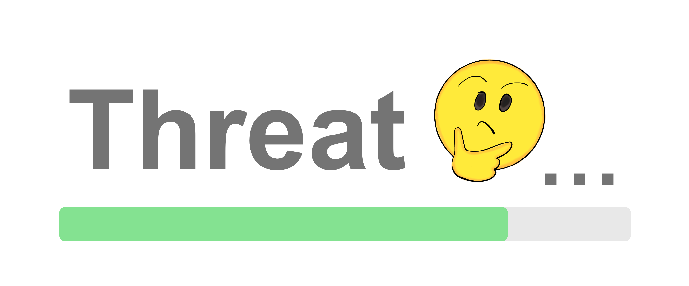
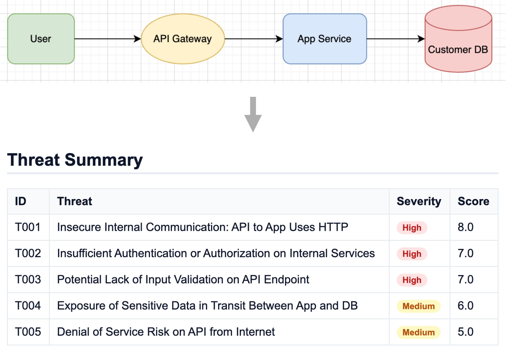
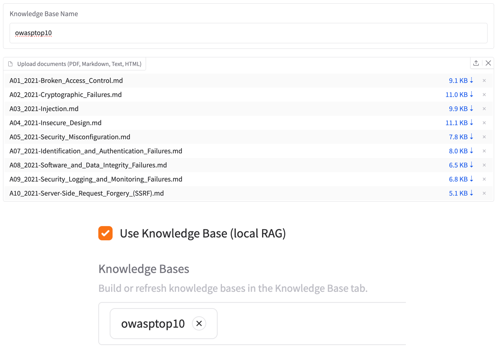
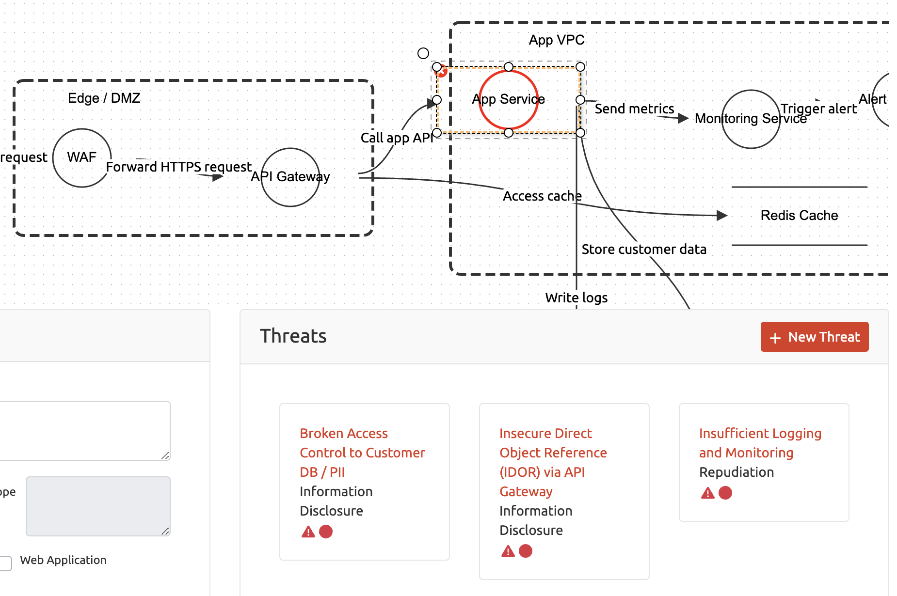

# Threat Thinker
AI-powered threat modeling that turns architecture diagrams into actionable risks.




## What is Threat Thinker?
Threat Thinker is an open-source tool that turns architecture diagrams into threat models automatically. It keeps models current with minimal manual work by pairing deterministic parsing with LLM reasoning.

Key Features:
- **Diagram coverage**: Ingests Mermaid, draw.io, Threat Dragon JSON, and images.
- **Attribute inference**: Uses LLMs to enrich components, data flows, and trust boundaries.
- **RAG boost**: Strengthens threat reasoning with local docs/KBs (e.g., OWASP/MITRE/internal).
- **Threat Dragon**: Imports Threat Dragon diagrams and can export findings back in Threat Dragon format.
- **Reports**: Exports Markdown, JSON, and HTML for reviews and automation.

## Key Features
### Diagram-to-threat reasoning
- Drop in a diagram via CLI (`--diagram` or format-specific flags) or Web UI and get threats without manual modeling.
- Supports Mermaid, draw.io, Threat Dragon JSON, and image-based diagrams with autodetection.
- Deterministic parsing plus LLM reasoning fills missing labels, trust boundaries, and protocols.
- Outputs prioritized threats with short rationales and OWASP ASVS/CWE references for quick review.

<p align="center">
     
    <br>
    <em>Input diagram and get prioritized threats automatically</em>
</p>

### Local RAG to boost accuracy
- Build on-disk knowledge bases from PDFs/Markdown/HTML with `threat-thinker kb build` under `~/.threat-thinker/kb/<name>`.
- Enable `--rag` in CLI or the “Use Knowledge Base” toggle in Web UI to ground LLM answers in security guidelines and your org's guidance.
- Retrieval stays local; only the final prompts go to your chosen LLM provider.
- Tune top-k per run and swap KBs per project to balance depth, speed, and relevance.

<p align="center">
     
    <br>
    <em>Build local knowledge bases and use them to strengthen threat reasoning</em>
</p>

### Threat Dragon round-trip
- Import [Threat Dragon](https://owasp.org/www-project-threat-dragon/) v2 JSON with `--threat-dragon`, preserving layout and cell metadata.
- Export a Threat Dragon-compatible JSON that embeds detected threats without regenerating positions.
- Re-open the exported JSON in Threat Dragon to review or adjust cells with the added findings.
- Markdown/JSON/HTML reports stay available alongside Threat Dragon output for broader sharing.

<p align="center">
     
    <br>
    <em>Import and export Threat Dragon diagrams with embedded threat findings</em>
</p>

## Getting Started
### Set Up API Keys
Threat Thinker uses LLM for extracting diagrams from images, extracting components, data flows, and trust boundaries from architecture diagrams, and for inferring threats. Threat Thinker supports OpenAI, Anthropic Claude, AWS Bedrock (Claude v3+ models), and local Ollama APIs (for text-only flows).

You must set at least one of the following environment variables before use:

```bash
# For OpenAI API (e.g., gpt-4.1)
export OPENAI_API_KEY=...

# For Claude API (e.g., claude-sonnet-4-5)
export ANTHROPIC_API_KEY=...

# For Bedrock API (e.g., anthropic.claude-sonnet-4-5-20250929-v1:0)
# Option 1: Use AWS Profile (recommended)
aws configure --profile my-profile
# Then use --aws-profile my-profile in the command

# Option 2: Use environment variables
export AWS_ACCESS_KEY_ID=...
export AWS_SECRET_ACCESS_KEY=...
export AWS_SESSION_TOKEN=...
```

### Local Ollama (no API key)
- Start Ollama locally (default host `http://localhost:11434`) and pull a model (e.g., `ollama pull llama3.1`).
- Run Threat Thinker with `--llm-api ollama --llm-model <model> [--ollama-host http://localhost:11434]` for Mermaid/Draw.io/Threat Dragon inputs.
- Image extraction is not supported with the Ollama backend; use text-based diagram inputs instead.

### Installation

```bash
# Option 1 (Recommended): Install as a CLI tool using uv
uv tool install \
  https://github.com/melonattacker/threat-thinker/releases/download/vX.Y.Z/threat_thinker-X.Y.Z-py3-none-any.whl

# Option 2: Development / editable install
git clone https://github.com/melonattacker/threat-thinker.git
cd threat-thinker

uv venv
source .venv/bin/activate
uv pip install -e . -r requirements.txt
```

### CLI Usage
Here is an example of command using CLI mode.


```bash
# Think: Analyze a diagram
threat-thinker think \
    --diagram examples/web/system.mmd \
    --infer-hints \
    --topn 5 \
    --llm-api openai \
    --llm-model gpt-4.1 \
    --out-dir reports/

# Diff: Compare two threat reports and analyze changes
threat-thinker diff \
    --after reports/new-report.json \
    --before reports/old-report.json \
    --llm-api openai \
    --llm-model gpt-4.1 \
    --out-dir reports/ \
    --lang en

# Run threat analysis with local Ollama (text-only diagrams)
threat-thinker think \
    --mermaid examples/web/system.mmd \
    --llm-api ollama \
    --llm-model llama3.1 \
    --ollama-host http://localhost:11434 \
    --out-dir reports/
```

### Web UI

```bash
# Launch Web UI
threat-thinker webui
```

Then visit http://localhost:7860 to use Threat Thinker interactively.

## Documentation
- [docs/tutorials.md](./docs/tutorials.md) — Guided runs for web, AWS, and diff scenarios.
- [docs/cli.md](./docs/cli.md) — Flag reference and examples for think/diff/kb commands.
- [docs/design.md](./docs/design.md) — Architecture and processing flow across the five layers.
- [docs/rag.md](./docs/rag.md) — Building and using local knowledge bases to strengthen threat reasoning.
- [docs/reports.md](./docs/reports.md) - Report formats and contents for Markdown, JSON, HTML, Threat Dragon and diff outputs.
