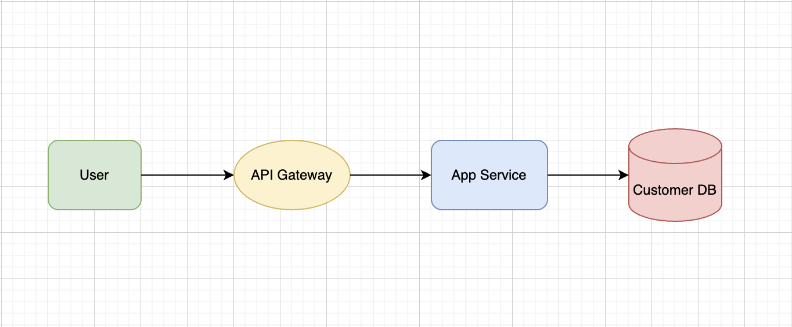
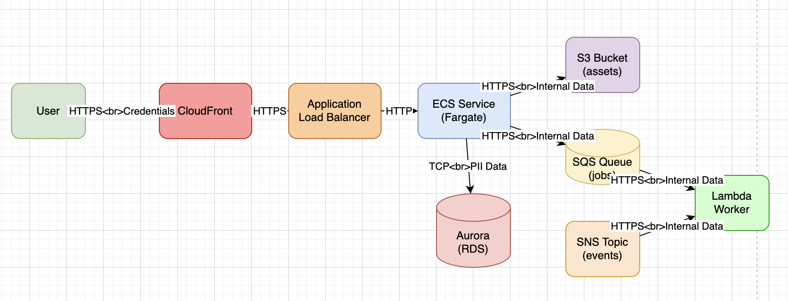

# Tutorials
## Tutorial 1: Analyze simple web application
In this example, we will analyze the architecture diagram of a simple web application.  written in mermaid and identify potential threats.

### What This Does
- Analyzes a simple 3-tier web application architecture with User → API Gateway → App Service → Database flow
- Uses Mermaid diagram format to parse the system components and data flows
- Automatically infers potential security hints and generates the top 5 highest-priority threats
- Applies STRIDE methodology to identify threats across spoofing, tampering, repudiation, information disclosure, denial of service, and elevation of privilege
- Outputs results in Markdown format with detailed threat descriptions, affected components, and security references

### Diagram



### Command

```bash
threat-thinker think \
    --mermaid examples/web/system.mmd \
    --infer-hints \
    --topn 5 \
    --llm-api openai \
    --llm-model gpt-4.1 \
    --format all \
    --out-md reports/web-report.md \
    --out-json reports/web-report.json \
    --out-html reports/web-report.html
```

### Discovered potential threats
| ID | Threat | Severity | Score |
|----|---------|---------|-------|
| T001 | Lack of Authentication on API Endpoint | High | 8.0 |
| T002 | Unencrypted HTTP Communication Between API and App | High | 8.0 |
| T003 | No Authentication or Authorization Between App and Database | High | 7.0 |
| T004 | No Input Validation on API Endpoints | Medium | 5.0 |
| T005 | Potential Information Disclosure from API in DMZ | Medium | 5.0 |

- [Markdown Report](../examples/web/report.md)
- [JSON Report](../examples/web/report.json)

### What Was Discovered
The analysis identified 5 critical security threats in this simple web application:

**High Severity Threats:**
- **Lack of Authentication on API Endpoint**: API in DMZ lacks authentication, allowing unauthorized access from the Internet
- **Unencrypted HTTP Communication Between API and App**: HTTP protocol between 'api' and 'app' in DMZ/Private zones exposes data to interception and tampering
- **No Authentication or Authorization Between App and Database**: No authentication or access control is specified for the app-to-db connection, risking unauthorized data access

**Medium Severity Threats:**
- **No Input Validation on API Endpoints**: API may be vulnerable to injection or malformed input attacks due to missing validation
- **Potential Information Disclosure from API in DMZ**: API in DMZ may expose sensitive internal data if not properly filtered or sanitized

## Tutorial 2: Analyze AWS system
In this example, we analyze the architecture diagram of the AWS-based system shown in the screenshot to identify potential threats.

### What This Does
- Analyzes a complex AWS cloud architecture from an image/screenshot rather than a text-based diagram
- Processes a multi-tier system including CloudFront, Load Balancer, ECS Fargate, Aurora RDS, S3, SQS, SNS, and Lambda
- Uses the `--require-asvs` flag to ensure all threats are mapped to OWASP Application Security Verification Standard (ASVS) requirements
- Generates the top 10 most critical threats with detailed scoring and evidence
- Demonstrates image-based analysis capabilities for existing architecture documentation

### Diagram



### Command

```bash
threat-thinker think \
    --image examples/aws/system.png \
    --infer-hints \
    --require-asvs \
    --topn 10 \
    --llm-api openai \
    --llm-model gpt-4.1 \
    --format both \
    --out-md reports/aws-report.md \
    --out-json reports/aws-report.json
```

### Discovered potential threats

| ID | Threat | Severity | Score |
|----|---------|---------|-------|
| T001 | Potential Exposure of PII Over Unencrypted Database Connection | High | 8.0 |
| T002 | Unencrypted Traffic Between Load Balancer and ECS Service | High | 8.0 |
| T003 | Lack of Authentication on Application Load Balancer | High | 7.0 |
| T004 | Insufficient Access Controls on S3 Bucket (Assets) | Medium | 6.0 |
| T005 | Potential Lack of Input Validation on ECS Service | Medium | 6.0 |
| T006 | Denial of Service via Unrestricted Public Entry Points | Medium | 5.0 |
| T007 | Insufficient Logging and Auditing for Sensitive Operations | Medium | 5.0 |
| T008 | Lack of Encryption at Rest for Sensitive Data Stores | Medium | 5.0 |
| T009 | Over-Privileged Lambda Worker Access | Medium | 5.0 |
| T010 | Potential Information Disclosure via SNS/SQS Misconfiguration | Medium | 5.0 |

- [Markdown Report](../examples/aws/report.md)
- [JSON Report](../examples/aws/report.json)

### What Was Discovered
The AWS architecture analysis revealed 10 significant security threats, highlighting the complexity of cloud security:

**High Severity Threats:**
- **Potential Exposure of PII Over Unencrypted Database Connection**: PII is transmitted over a generic TCP connection, which may not be encrypted, risking data exposure
- **Unencrypted Traffic Between Load Balancer and ECS Service**: Traffic between the load balancer and ECS service uses HTTP, exposing sensitive data to interception or modification
- **Lack of Authentication on Application Load Balancer**: The load balancer does not enforce authentication, allowing unauthenticated access to backend services

**Medium Severity Threats Include:**
- **Insufficient Access Controls on S3 Bucket (Assets)**: S3 bucket contains internal data and may be accessed by unauthorized entities if IAM policies are misconfigured
- **Potential Lack of Input Validation on ECS Service**: User input flows from the internet to ECS service, risking injection attacks if not validated
- **Denial of Service via Unrestricted Public Entry Points**: Public-facing endpoints may be targeted for DoS attacks due to lack of rate limiting or WAF
- **Insufficient Logging and Auditing for Sensitive Operations**: Lack of comprehensive logging may hinder detection and investigation of security incidents involving PII or internal data
- **Lack of Encryption at Rest for Sensitive Data Stores**: Sensitive data may be stored unencrypted at rest, risking exposure if storage is compromised
- **Over-Privileged Lambda Worker Access**: Lambda worker may have excessive permissions to queues, increasing risk if compromised
- **Potential Information Disclosure via SNS/SQS Misconfiguration**: Internal data in queues/topics could be exposed if access policies are too permissive

## Tutorial 3: Analyze the difference between before and after reports
In this example, we will analyze the differences between the threat analysis results for an updated web application diagram and those for the previous version of the diagram.

### What This Does
- Compares threat analysis results between two different system architectures to identify security improvements and new risks
- Analyzes the security impact of architectural changes by examining added/removed components and data flows
- Uses the `diff` command to automatically generate comprehensive change analysis reports
- Demonstrates how security posture changes when defensive controls (WAF, logging, monitoring) are added to a system
- Provides recommendations for addressing new risks introduced by architectural modifications
- Shows both positive security implications and potential new attack surfaces created by system evolution

### Diagram

#### Before


#### After


### Command

```bash
threat-thinker diff \
    --after examples/web/updated-report.json \
    --before examples/web/report.json \
    --llm-api openai \
    --llm-model gpt-4.1 \
    --out-md examples/web/diff-analysis.md \
    --out-json examples/web/diff-analysis.json \
    --lang en
```

- [Markdown Report](../examples/web/diff-analysis.md)
- [JSON Report](../examples/web/diff-analysis.json)

### What Was Discovered
The difference analysis between the original and updated web application architecture revealed significant security improvements alongside new considerations:

**Architectural Enhancements:**
- **6 New Components Added**: WAF (ingress protection), Cache (performance), Logging Service, Analytics DB, Monitoring Service, and Alert Manager
- **Improved Defense in Depth**: Multiple layers of protection and observability now protect the core application
- **Enhanced Incident Response**: Comprehensive logging, monitoring, and alerting capabilities enable faster threat detection and response

**Security Improvements:**
- **Web Application Firewall (WAF)**: Provides critical ingress filtering to block common web attacks (SQL injection, XSS, etc.)
- **Comprehensive Observability**: Logging, monitoring, and alerting enable detection of suspicious behavior and compliance with security best practices
- **Advanced Threat Detection**: Analytics on logs can identify subtle attack patterns that basic monitoring might miss

**New Risks Introduced:**
- **Expanded Attack Surface**: 6 new components create additional potential entry points for attackers
- **Configuration Complexity**: More components increase the risk of misconfigurations that could expose sensitive data
- **Protocol Security Gaps**: Several new internal connections use 'unknown' protocols, potentially lacking encryption

**Critical Gaps Identified:**
- **Threat Model Not Updated**: Despite significant architectural changes, the threat model wasn't updated to address new components and flows
- **Authentication Issues**: Cache, logs, analytics, monitor, and alerts services lack proper authentication controls
- **Internal Communication Security**: New service-to-service communications may not use secure protocols

**Recommendations:**
The analysis recommended updating the threat model to include all new components, securing new services with proper authentication and encrypted communications, and conducting regular security audits of the expanded infrastructure.
